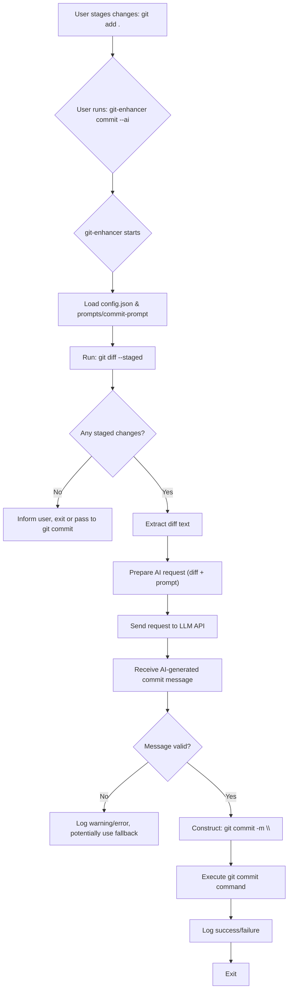

# Git Enhancer

`git-enhancer` is a command-line tool that supercharges your Git workflow with AI capabilities. Currently, it focuses on automatically generating commit messages based on your staged changes.

## Features

-   **AI-Powered Commit Messages**: Automatically generates commit messages using a large language model (LLM) by analyzing your staged diff.
-   **Standard Git Commit Passthrough**: Seamlessly integrates with your existing `git commit` workflow. If you don't use the AI feature, it behaves like the standard `git commit`.
-   **Configurable**: Allows customization of the AI model, API endpoint, temperature, and system prompts.
-   **AI-Powered Command Explanation**: Get AI-generated explanations for Git commands and their options directly in your terminal.
-   **Tracing/Logging**: Provides detailed logs for debugging and monitoring.

## Installation

1.  **Prerequisites**:
    *   Rust and Cargo: [Install Rust](https://www.rust-lang.org/tools/install)
    *   Git: Must be installed and in your PATH.
    *   (Optional) An OpenAI-compatible LLM API endpoint (e.g., Ollama running a model locally, or a remote service).

2.  **Build from Source**:
    ```bash
    git clone <repository_url> # Replace with the actual repository URL
    cd git-enhancer
    cargo build --release
    ```
    The executable will be located at `target/release/git-enhancer`. You can copy this to a directory in your PATH, e.g., `~/.local/bin/` or `/usr/local/bin/`.

    ```bash
    # Example:
    # mkdir -p ~/.local/bin
    # cp target/release/git-enhancer ~/.local/bin/
    # Ensure ~/.local/bin is in your PATH
    ```

## Configuration

`git-enhancer` uses a `config.json` file in its root directory for AI-related settings and a `prompts/commit-prompt` file for the system prompt used during commit message generation.

1.  **Create `config.json`**:
    Copy the example configuration file `config.example.json` to `config.json` in the root of the `git-enhancer` project (or the directory where you run the executable if it's globally installed and expects the config there - this might need adjustment for global installs).

    ```bash
    cp config.example.json config.json
    ```

    Edit `config.json` with your preferred settings:
    ```json
    {
      "api_url": "http://localhost:11434/v1/chat/completions", // Your LLM API endpoint
      "model_name": "qwen3:32b-q8_0",                        // The model to use
      "temperature": 0.7,                                     // LLM temperature
      "api_key": "YOUR_API_KEY_IF_NEEDED"                   // API key, if required by your endpoint
    }
    ```
    *   `api_url`: The URL of your OpenAI-compatible chat completions endpoint.
    *   `model_name`: The specific model identifier your API endpoint expects.
    *   `temperature`: Controls the creativity of the AI. Higher values mean more creative/random, lower values mean more deterministic.
    *   `api_key`: Your API key, if the service requires one. This is optional.

2.  **Customize `prompts/commit-prompt`**:
    The `prompts/commit-prompt` file contains the system prompt given to the AI to guide its commit message generation. You can edit this file to change the style, tone, or specific requirements for your commit messages.

    The default prompt encourages conventional commit style messages.

    *Note: If `config.json` is not found, `git-enhancer` will use default values, but it will fail if `prompts/commit-prompt` is missing.*

## Usage

`git-enhancer` acts as a wrapper around `git commit`.

### AI-Generated Commit Message

To have AI generate your commit message based on staged changes:

1.  Stage your changes as usual:
    ```bash
    git add <file1> <file2> ...
    ```
2.  Run `git-enhancer commit --ai`:
    ```bash
    git-enhancer commit --ai
    ```
    Or, if you've aliased `git enhancer` or similar:
    ```bash
    git enhancer commit --ai
    ```

    You can also pass through other `git commit` arguments:
    ```bash
    git-enhancer commit --ai -S  # For GPG signing
    ```

### Standard Commit Message

To use `git-enhancer` like the standard `git commit`:

-   With a message:
    ```bash
    git-enhancer commit -m "Your commit message"
    ```
-   To open your configured Git editor:
    ```bash
    git-enhancer commit
    ```

### AI-Powered Command Explanation

`git-enhancer` can provide AI-generated explanations for Git commands. This is primarily activated by a global `--ai` flag. The behavior adapts based on how `--ai` is used and the other arguments provided. The first `--ai` encountered in the command arguments triggers this global AI mode.

**1. Explain Git Command Help Output**

If you use `--ai` along with a Git command that includes a help flag (`-h` or `--help`), `git-enhancer` will first fetch the standard help text for that command and then provide an AI-generated explanation of that help text.

```bash
# Get AI explanation for the 'git status --short' help page
git-enhancer --ai status --short --help

# The --ai flag can be anywhere
git-enhancer status -s --ai --help
```

**2. Explain Git Command Functionality**

If you use `--ai` with a Git command *without* a help flag, `git-enhancer` will provide an AI-generated explanation of what that specific command and its options do. This applies if the command is not a `git-enhancer` specific subcommand that has its own AI behavior (like `commit --ai` for message generation).

```bash
# Get AI explanation for what 'git log --oneline -n 5' does
git-enhancer --ai log --oneline -n 5

# Get AI explanation for 'git commit -m "message"' (as 'commit' subcommand's own AI flag is not active)
git-enhancer --ai commit -m "A standard commit message"
```

**Interaction with `git-enhancer commit --ai` (Message Generation):**

The global `--ai` for explanation is distinct from the `--ai` flag used with `git-enhancer commit` for generating commit messages.

*   **To explain `git commit --help`**:
    ```bash
    git-enhancer --ai commit --help
    ```
*   **To generate a commit message with AI (existing feature)**:
    ```bash
    git-enhancer commit --ai
    ```
*   **To explain the command `git commit --ai` itself (if `commit --ai` was a standard git command)**:
    If `git-enhancer`'s `commit` subcommand *didn't* have its own `--ai` for message generation, `git-enhancer --ai commit --ai` would explain the `git commit --ai` command. However, because `git-enhancer commit` *does* have its own `--ai` flag for message generation, the following happens:
    ```bash
    git-enhancer --ai commit --ai -S
    ```
    Here, the first `--ai` triggers global AI mode. The remaining parts (`commit --ai -S`) are then parsed. Since `commit --ai` is a recognized `git-enhancer` AI-specific operation (message generation), that operation takes precedence over explaining the command. So, this command would generate an AI commit message for GPG-signed commits.

**Standard Git Command Passthrough (No Global `--ai`)**

If the global `--ai` flag is not present, `git-enhancer` behaves as follows:
- If the command is a recognized `git-enhancer` subcommand (like `commit`), it executes that subcommand's logic (e.g., `git-enhancer commit --ai` for message generation, or `git-enhancer commit -m "..."` for standard commit).
- If the command is not a recognized `git-enhancer` subcommand, it's passed directly to the system's `git`.
    ```bash
    git-enhancer status -s  # Executes 'git status -s'
    ```

### Logging

`git-enhancer` uses `tracing` for logging. By default, logs are printed to standard error. You can control the log level using the `RUST_LOG` environment variable.

Example:
```bash
RUST_LOG=debug git-enhancer commit --ai
```

## Workflow Diagram (AI Commit)



## Development

For details on the project structure, contribution guidelines, and more, please see `doc/DEVELOPMENT.md`.

### Quick Links for Developers
- Building: `cargo build`
- Running tests: `cargo test` (once tests are added)
- Formatting: `cargo fmt`
- Linting: `cargo clippy`

## License

This project is licensed under the [MIT License](LICENSE). (Assuming MIT, add a LICENSE file if you choose this)
